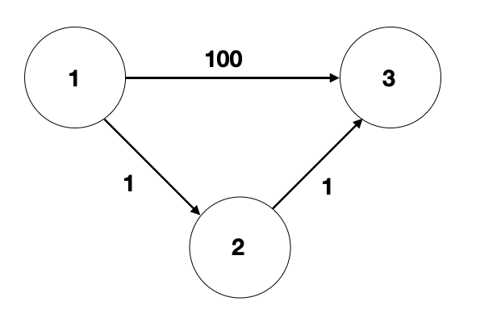

# C++

-----
### Edge Test Case 작성 요령

최대한 자신의 코드를 공격해 보려고 노력.

주어진 테스트 케이스 이외의 테스트 케이스도 반드시 테스트 해볼것..

-----
### 내가 자주 실수하는 것들

1. BFS 구현할 때, que.pop()을 자주 빼먹는다.
2. 범위 검사할 때, 실수하지 말자
3. 배열 사이즈 선언을 실수할 때가 있다.
4. BFS로 최단 거리를 구할 때, 최초로 진입하는 r,c를 한번 더 방문하지 않도록 구현하는 것이 안전하다.

<strong>소스 예시</strong>

```
void BFS (int sr, int sc ) {
	while ( !que.empty() ) {
        int r = que.front().first;
        int c = que.front().second;
        que.pop();
	
	for(int i = 0; i < 4; i++) {
            int nr = r + UD[i];
            int nc = c + LR[i];

            *** if ( nr == sr && nc == sc ) continue; ***
	    
	    ...
	 	}
	}
}
	
```

5. BFS 구현 시, 최초로 Queue에 push할 바로 그 때 적용되는 case에 대해서의 처리 여부를 반드시 확인할 것

<strong>소스 예시</strong>
```
void BFS (int sr, int sc) {
    queue<pair<int,int>> que;
    int sheepCnt = 0, wolfCnt = 0;

    // 이 부분을 말하는 것!!!!
    if (arr[sr][sc] == 'v') {
        wolfCnt++;
    } else if ( arr[sr][sc] == 'o') {
        sheepCnt++;
    }
    visited[sr][sc] = true;

    que.push({sr,sc});


    while (!que.empty()) {
        int r = que.front().first;
        int c = que.front().second;
        que.pop();
```

6. ***isalpha 함수 사용시 주의할 점***

- 빈 문자열을 검사할 시, out_of_range 런타이 에러르 뱉는다. 이유는, trim 과정에서 문자열이 제거되는 경우 때문!!

```
void trim(string &str) {
    while (!isalpha(str.front())) {
        *** if (str.empty()) break; ***
        str = str.substr(1,-1);
    }
    while (!isalpha(str.back())) {
        *** if (str.empty()) break; *** 
        str.pop_back();
    }
}
```

-----

### cmp 함수 주의할 점!
sort의 cmp함수는 Strict Weak Ordering을 따른다.

이 조건 중, 반드시 R(a,a) = false 이어야 하는 조건이 있으므로 if ( a == b ) return true; 로 하게 되면 오류가 발생한다.

그러므로, if( a == b ) return false; 가 되어야 한다.

-----
#### 런타임 에러의 원인
1. 배열에 할당된 크기를 넘어서 접근했을 때 또는 -idx에 접근했을때
2. 전역 배열의 크기가 메모리 제한을 초과할 때
3. 지역 배열의 크기가 스택 크기 제한을 넘어갈 때
4. 0으로 나눌 떄
5. 라이브러리에서 예외를 발생시켰을 때
6. 재귀 호출이 너무 깊어질 때
7. 이미 해제된 메모리를 또 참조할 때

-------
#### 재귀함수 

```
void f( 1 ) {
	f(0);
	printf("%d", n);
}
```

```
void f( 1 ) {
	return; //return으로 치환되는 것이 아니다. 단지 그냥 f(0) 함수가 종료될 뿐, 밑에 코드는 진행된다.
	printf("%d", n);
}
```

------
#### 배열 크기 할당은 웬만하면 데이터 영역에 하기

```
// 전역 변수로 선언했다고 가정!!!

int num = 1; 
int *ptr = &num; // num, ptr, 1 모두 데이터 영역에 저장된다.

int *ptr = new int[1]; // ptr -> 데이터 영역, *ptr -> 힙 영역에 저장된다.

//포인터를 전역으로 잡으면
//포인터를 저장하는 변수만!! 데이터 영역에 잡히고,
//실제 유효한 데이터를 저장하는 배열 공간은 힙에 잡힌다.
```

-----
### vector erase 사용할 때 주의할 점


------
### vector 요소 옆으로 옮기기 

```
vector<int> abc{1,2,3,4,5};
    int tmp = abc[0];
    int tmp2 = 0;
    for(int i = 0; i < 4; i++) {
        tmp2 = abc[i+1]; // 1
        abc[i+1] = tmp;
        tmp = tmp2;
    }
    
//그냥 이렇게하면 편하긴 함
for(int i = 5; i > 0; i--) {
        abc[i] = abc[i-1];
    }

abc[0] = 0;
```

----
### BST vs max/minheap
BST : 자기보다 작은 놈 왼쪽, 큰 놈 오른쪽

heap : max 또는 min 값을 빠르게 찾아내기 위한 자료구조, complete binary tree로 구성

----
### BFS vs 다익스트라 알고리즘
BFS는 모든 간선의 가중치가 동일할 때, 다익스트라는 동일하지 않을 때 사용하면 된다.
'트리의 경우'에는 두 정점을 잇는 경로가 유일하기 때문에 가중치의 유무에 상관 없이 BFS를 해도 되고, 심지어는 BFS가 아니라 DFS를 해도 됩니다. 거리가 '갱신되는' 과정 자체가 없기 때문이다.

"그래프일 경우"

간선의 가중치가 모두 동일 -> BFS

그렇지 않은 경우 -> 다익스트라


"트리인 경우"

DFS or BFS

#### "다익스트라 알고리즘에서 if( d[cur] < curDis ) continue는 왜 존재해야하는가?" 

```
while( !pq.empty() ) {
        int cur = pq.top().first;
        int curDis = pq.top().second;
        pq.pop();

    *** if( d[cur] < curDis ) continue; ***
        for(int i = 0; i < vec[cur].size(); i++) {
            int nextNode = vec[cur][i].first;
            int nextDist = vec[cur][i].second;

            int newDist = nextDist + d[cur];
            if( d[nextNode] > newDist ) {
                d[nextNode] = newDist;
                pq.push({nextNode, newDist});
            }
        }
    }
```

위 그림과 같은 상황에서, cur과 curDis를 뽑아보면

1번째 (0, 0) //cur, curDis

2번째 (2, 1)

3번째 (3, 2)

4번째 (3, 100) <== 이 때를 위한 코드이다. 즉, 같은 정점이 여러번 뽑힐 수가 있고 2번째 뽑힌 정점(3,100)은 이미 정점이 첫번째로 뽑힌 시점(3,2)보다 꾸진 시점이라 주변 간선을 다시 보는 행위가 필요없기 때문이다.


-----
### 자료구조 라이브러리를 사용할 때 주의할 점.

```
for(int i = 0; i < que.size(); i++) {
	//이곳에서 que.push() or que.pop()을 하게 되면, 사이즈가 변경되어 원하는대로 for문이 동작하지 않을 수 있다.
	//그러므로 for문 밖에 size 변수를 두어, size 값을 고정 해야한다.
}
```
-----

### 정렬 커스텀 시, const와 reference를 쓰는 이유 

https://www.inflearn.com/questions/23817

-----
### Transform 함수를 사용해서 문자열을 대소문자로 변환 가능하다

```
transform(str.begin(), str.end(), str.begin(), ::tolower);
```
-----

<h3>Map 활용법</h3>

Map의 value를 기준으로 정렬할 땐, vector를 이용한다.

```
map<string, int> mp;
vector<pair<string, int>> vec(mp.begin(), mp.end(); // 바로 초기화 가능
```

**classic : {0, 800}, {1,200}
pop : {3,200}, {2,500}과 같은 데이터를 Map을 사용해 저장하고 정렬하려면?**

**map -> vector로 정렬 -> 다시 map에 insert**방법은 안된다.
> map에 value로 정렬된 값으로 들어가지 않는다. key값으로 다시 재정렬된다.

vector로 정렬한 순서대로 map의 원소에 꽂고 싶으면

1. ***정렬된 순서의 key값을 원소로 갖는*** 임의의 vector를 1개 더 생성한다. 
```
vector<int> vecIdx 
for (int i = 0; i < vecIdx.size(); i++) {
    //mp[key][vecIdx[i]]를 하게 되면 vecIdx에 저장된 정렬 순으로 mp의 값들을 꺼내올 수 있다.
}
```

2. 
```
 map<string, vector<pair<int,int>>> mp;
 mp[key].push_back( each 정렬된 벡터값 );
```

### :pill: map<int, map<int,int>> mp 사용법 ###

https://www.geeksforgeeks.org/implementing-multidimensional-map-in-c/

-----

# JAVA
-----
### vector<int> vec[]와 같이, ArrayList를 선언하는 법

```
ArrayList<E>[] arrayList = new ArrayList[N]; //N개의 ArrayList<E> 배열을 선언하고,
for(int i = 0; i < N; i++) {
	arrayList[i] = new ArrayList<E>(); //각 배열마다, ArrayList 클래스를 만들어준다..?
	}
```
	
for문을 돌리지 않으면, ```ArrayList<E> ar;``` <-- 이렇게만 선언해놓은 것과 같다. 그렇기 때문에 <strong>new 생성자를 통해 참조값을 할당해주어야 사용이 가능하다.</strong>


-----
### comparable VS comparator

comparable은 interface이므로, 상속받아서 그 compareTo 함수를 Override해서 사용한다.

하지만, comparator는 class이므로 그 자체가 기준이 될 수 있다. 다시 말해, 다른 곳에서 class의 compare를 Override해서 기준으로써 사용할 수 있다.


Ex)
```
PriorityQueue<node> pq = new PriorityQueue<>(new Comparator<node>() {

            @Override
            public int compare(node a, node b) {
                if(a.value > b.value) return 1; //*** 양수를 반환할 경우, 위치를 바꾼다. 즉 이 코드의 경우엔 a.value가 클 경우 위치가 바뀐다.
						//    반대로, a.value < b.value이면, a.value가 작은 경우 위치가 바뀐다.
//                else if( a.value > b.value) return -1;
                else return -1; 
            }
        })
```
-----	
<h1>부동 소수점을 주의하자</h1>

ex) 0.1xxxxxxxxxxx인 경우 컴퓨터는 0.1로 표시, 즉, 0.1 * 100은 10이 되야하지만, 9.999999999와 같은 값을 갖게 되는 '오류'가 발생한다.

<h3>따라서 해당 소숫점 데이터를 다룰 땐 주의해야한다!!</h3>

